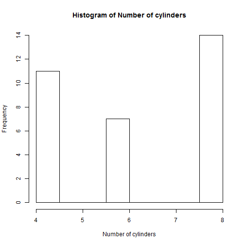

## Exploring Data on Cars

This is an application based on the dataset mtcars in R. The data was extracted from the 1974 Motor Trend US magazine, and comprises fuel consumption and 10 aspects of automobile design and performance for 32 automobiles (1973-74 models).

A user wants to know how car attributes are distributed. This application offers a selection dropdown to show  the histograms of the variables:
Miles/(US) gallon, Number of cylinders, Gross horsepower, Weight (lb/1000).

--- .class #id 

## Distribution of Car Variables
For example, there are more cars with 4 cylinders than 6. Most cars in this data have 8 cylinders.

--- .class #id 

## Histogram of Cylinders
 

--- .class #id 

## Average Miles per Gallon for a given cylinder size

A user wants to know the average miles per gallon for cars in the data with 8 cylinders


```r
tapply(mtcars$mpg, mtcars$cyl, mean)[[3]]
```

```
## [1] 15.1
```


